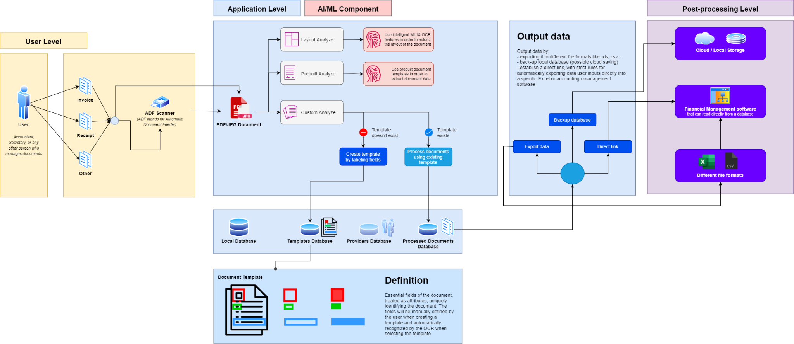

 

  

> For the official presentation in Romanian see: [Official Presentation (RO)](https://docs.google.com/presentation/d/1NE-3EPntD04tFKVPOI1Jnk2dVM2oLqkTfXUmQ6W1b60/edit?usp=sharing)

# General Presentation
**UNpaper** is the practical part (project implementation) of my Bachelor Thesis at Transilvania University of Brasov (Romania).

**UNpaper** is a complex Document Digitizer Cloud Solution, implemented using Azure Cloud Architecture, Microservices, Serverless components, Single Page Applications,  Databases and Blob Storages, and other similar technologies.

The main purpose of **UNpaper** is to reduce time spent by medium and small sized businesses in redundant document processing activities, such as registering documents by hand. **UNpaper** thus automates the pre-processing part of analogous data (e.g. invoices, receipts, identification documents, etc.).

## Thesis Abstract

Countless domains and professional fields are lacking proper digitalization and automation when it comes to redundant daily processes and tasks. Numerous documents are massively pre-processed, as the data is being manually introduced in different administrative, financial, or managerial systems. These processes are highly demanding in terms of time and effort, and it would be more efficient to invest these resources into more high-level activities that require human assistance, such as: analyzing, consulting, managing, etc. The purpose of this paper is to describe the existing problems, and to explain the researching, analyzation, testing, and implementation processes of the proposed solution, more specifically a document digitizer cloud solution, which involves: a cloud architecture, state-of-the-art cognition technologies, Single Page Applications, modern data storage and management techniques, and last but not least intuitive userfriendly functionalities.

## Objectives

The three **main objectives** of UNpaper are, as follows:
1. Reducing time spent by employees in redundant paperwork activities, automating the pre-processing part in the manner the users impose.
2. Being accessible to small and medium-sized businesses, and especially being user friendly for people who have previously worked mostly with analogous data and are now transitioning to a more digital environment.
3. Offering a high level of security and reliability, by using state-of-the-art architectures and technologies.

**Extensive objectives** of UNpaper are, as follows:
1. Upgrading intelligent user flows to recognize specific keywords, document structures, etc. and handle (ex: Notifying the administrator of documents due dates)
2. Provide users with more advanced tools meant for defining sandbox environments, in order to improve the genericity of the solution and grant users more specificity in their tasks and requests.
3. Implementing tools for more specific local paperwork and legislative requirements, like automatic generation of payment sheets.
4. Creating a more solid link between UNpaper and other databases, ERMs, and systems widely used in office work.

# Technical Presentation

## User Flow

The following diagram describes the user flow, as initially intended. The flow is split in 3 stages/levels as follows:
- **User Level:** The physical level, of the analogous data (i.e. documents which need to be processed).
- **Application Level:** The main level, this is the level where UNpaper comes into play by digitalizing and automating the process.
- **Post-processing Level:** This level concerns about future post-processing and storing functionalities wanted/needed by the user.

## Functionalities

### Layout Analysis
- Quick analyzation of document's structure
- Text extraction capabilities (i.e. OCR)
- Tables extraction in CSV format
- *Compatible with: PNG, PDF, JPG, TIFF, JSON*

### Prebuilt Analysis
- Quick analyzation of documents, based on pre-trained AI models (e.g. invoices, recipes, ID cards, etc.)
- Extraction of the analyzed data in a structured format (CSV)
- *Compatible with: PNG, PDF, JPG, TIFF, JSON*

|||
|:-:|:-:|

### Custom labeled analysis & resources management
- Custom user hierarchy builder based on organizations and batches (categories of documents)
- Custom models creation and training, later used for extracting data from custom documents in a structured format
- Simultaneously processing of multiple documents (in a queue)

|||
|:-:|:-:|
|||

## Project Structure

## Cloud Atchitecture

## Technologies and dependencies

## Future Improvements
